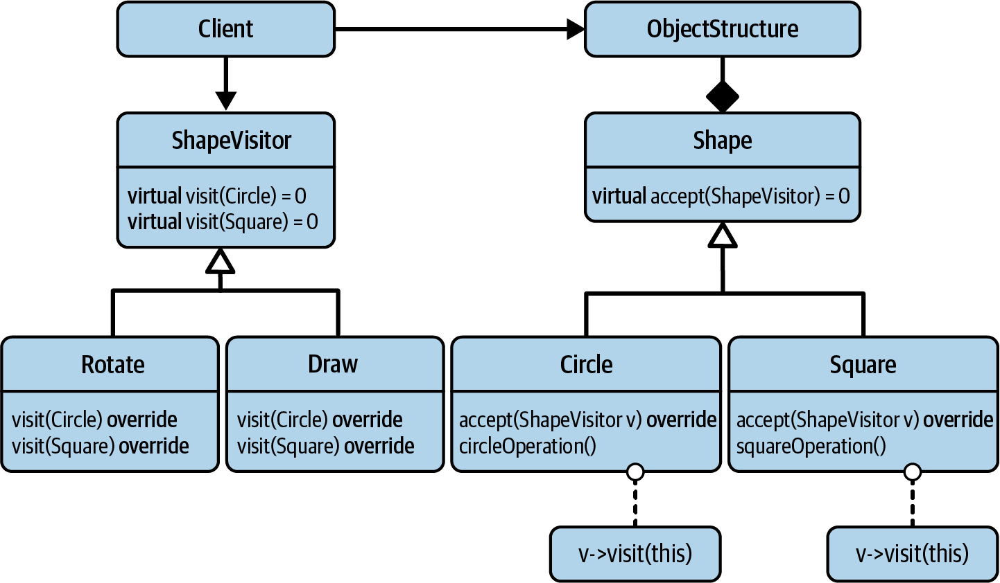

## Software Design: The Art of Managing Dependencies and Abstractions
- Dependency is the key problem in software development at all scales.
- keep unnecassary artificial dependencies at a minimum.
- Three levels of software development
    1. software architecture :  big decisions, the aspects of your software that are among the hardest things to change in the future. microservice, client-server, MVC
    2. software design : factory, visitor
    3. implementation details : make_unique, SFINAE, enable_if
- An idiom is a commonly used but language-specific solution for a recurring problem. copy-swap, RAII
- software design as the art of managing dependencies and abstractions.
  
## Design for change
### Seperation of concern
- Systems that are broken up into small, well-named, understandable pieces enable faster work
- Cohesion is a measure of the strength of association of the elements inside a module. A highly cohesive module is a collection of statements and data items that should be treated as a whole because they are so closely related. Any attempt to divide them up would only result in increased coupling and decreased readability.
- mane names same concept : seperation of concern, orthogonality, cohision, single responsibility principal
- group only those things that truly belong together, and separate everything that does not strictly belong.
- variation point, i.e., some aspect in your code where changes are expected.
  
### Don't Repeat Yourself
- Just as much as the SRP advises separating variation points, we should take care not to duplicate information throughout the codebase. As much as everything should have a single responsibility (a single reason to change), every responsibility should exist only once in the system.
- This principle advises us to not duplicate some key information in many places—but to design the system such that we can make the change in only one place

### Avoid Premature Separation of Concerns
- Don’t try to achieve SOLID, use SOLID to achieve maintainability.
- if you don’t know what kind of change to expect, then don’t guess—just wait.
- YAGNI - You Aren’t Gonna Need It

### Separate Interfaces to Avoid Artificial Coupling
- Segregate Interfaces to Separate Concerns
- Clients should not be forced to depend on methods that they do not use
- Minimizing Requirements of Template Arguments
  - std::copy needs only input & output iterator, which is bare minimul requirement, correct behaviour, 

### Design for testability
- The purpose of having tests is to be able to assert that all of your software functionality still works, despite constantly changing thing.
- A black box test does not make any assumptions about internal implementation details, but tests only for expected behavior.
- A black box test does not make any assumptions about internal implementation details, but tests only for expected behavior

### design for extention
- extensibility should indeed be one of your primary goals and a driving factor for good software design.
- OpenClose Principle : Software artifacts (classes, modules, functions, etc.) should be open for extension, but closed for modification.
- customization points
  - STL, templates, partial specialization, function pointers in STL algos.
  
## Art of building Abstraction

### Adhere to the Expected Behavior of Abstractions
- The Liskov Substitution Principle : is a relationship
- Preconditions cannot be strengthened in a subtype: a subtype cannot expect more in a function than what the super type expresses
- PostCondition cannot be weakened in subtype : 
- Function return types in a subtype must be covariant:
- Function parameters in a subtype must be contravariant
- Invariants of the super type must be preserved in a subtype: any expectation about the state of a super type must always be valid before and after all calls to any member function, including the member functions of the subtype:
  
###  Similarities Between Base Classes and Concepts
- LSP is not limited to dynamic (runtime) polymorphism and inheritance hierarchies. we can apply the LSP just as well to static (compile-time) polymorphism and templated code.
- Both the base class and the concept represent a set of requirements (syntactic requirements, but also semantic requirements)

### Semantic Requirements of Overload Sets
- based on some given types, the compiler figures out which function to call from a set of identically named functions. This is what we call an overload set.
- free function perfectly lives up to the spirit of the Open-Closed Principle (OCP): you can extend the functionality by simply adding code, without the need to modify already existing code.
- i.e begin & end free functions can be used for types other than STL containers.
- Overload operations that are roughly equivalent. && Overload only for operations that are roughly equivalent.

###  Pay Attention to the Ownership of Abstractions
- Dependency inversion principal
  - The most flexible systems are those in which source code dependencies refer only to abstractions, not to concretions.
- High-level modules should not depend on low-level modules. Both should depend on abstractions.
- Abstractions should not depend on details. Details should depend on abstractions.
- to get a proper dependency inversion, the abstraction must be owned by the high level

### Consider Creating an Architectural Document
- one common document that unifies the ideas, visions, and essential decisions in one place; helps maintain and communicate the state of the architecture; and helps avoid any misunderstandings.

## Design Patterns

### Purpose of Design Patterns
- Design pattern: Has a name, Carries an intent, Introduces an abstraction, Has been proven
- The name of a design pattern allows us to communicate on a very high level and to exchange a lot of information with very few words.
- Note that the abstraction introduced by a design pattern is not necessarily introduced by means of a base class. a design pattern does not imply any specific implementation.
- std::make_unique() is a recurring solution for a specific problem. In other words, it is a pattern. However, it isn’t a design pattern but an implementation pattern. (make unique is factory function, but not a factory design pattern)
- To summarize: a design pattern is a proven, named solution, which expresses a very specific intent. It introduces some kind of abstraction, which helps to decouple software entities and thus helps to manage the interaction between software entities.

### Beware of Design Pattern Misconceptions
- Design Patterns Are Not a Goal
- Design Patterns Are Not About Implementation Details
- Design Patterns Are Not Limited to Object-Oriented Programming or Dynamic Polymorphism.design patterns work equally well for static polymorphism and can therefore be used in combination with C++ templates.

### Design Patterns Are Everywhere
- Strategy - as a predicate, as allocater for containers
- Template Method Pattern : interface for pmr::memory resource
- Adapter - iterators & pmr vector & string
- Bridge - unique/shared ptr
  
## Visitor
### Design for the Addition of Types or Operations
- OpenClosed Principal 
  - 2 types of extension
    - new types
    - new operations
- The strength of object-oriented programming is the easy addition of new types, but its weakness is that the addition of operations becomes much more difficult.

### visitor pattern to extend operations
- The intent of the Visitor design pattern is to enable the addition of operations.
- Represent an operation to be performed on the elements of an object structure. Visitor lets you define a new operation without changing the classes of the elements on which it operates
- with the Visitor design pattern in place, it becomes difficult to add new type. 
- visitor pattern has cyclic dependency between Objects & visitors.
- double dispatch, needs 2 virtual functions to identify concrete object & operation combination, performance hit.
-  complex design pattern with some strong internal coupling and performance deficiencies.
  


### Consider std::variant for Implementing Visitor
- A variant represents one of several alternatives. std::variant<int, string, double> v;
- A default variant is also not empty. It is initialized to the default value of the first alternative.
- int i = get<int>(v);
- To store the alternatives, the variant provides just enough internal buffer to hold the largest of the alternatives.
- With std::get() you can query for a value of a particular type. If the variant contains a value of that type, it returns a reference to it. If it does not, it throws the std::bad_variant_exception.
- to Access.
  - get<int>
  - get_if<int>
  - visit -  allows you to pass a custom visitor to perform any operation on the stored value of a closed set of types.
- std::visit is passed an operation & type to visit, one of the variant type.dispatch is taken care by std::visit. 
  ```for( auto const& shape : shapes )
   {
      std::visit( Draw{}, shape );
   }
- this approach also have disadvantages of normal visitor patterns, but good perforance & less boiler plate. adding types is still issue & causes recompilation.

### Acyclic visitor
- avoids limitation of cyclic OOP visitor, but very heavy performance hit due to cross dynamic_cast & virtual function,


## Strategy & Command 
###  Use Strategy to Isolate How Things Are Done
- design for change, follow the SRP, and thus extract the variation point.
- *inheritance is rarely the answer.*
- Define a family of algorithms, encapsulate each one, and make them interchangeable. Strategy lets the algorithm vary independently from clients that use it.
- The Strategy design pattern appears to be strongest in situations where you need to isolate a small number of implementation details.
- Strategy, in contrast to Visitor, preserves the strength of OOP and enables you to easily add new types.
- Variation points is implementation detail of a single function, able to add new types/implementation easily, adding operations is not easy.


#### Policy-Based Design
- STL algos use a strategy design pattern. Both the std::partition() and the std::sort() algorithm make use of the Strategy design pattern. The UnaryPredicate argument of std::partition() () and the Compare argument of std::sort() () represent a means to inject part of the behavior from outside. or smart pointer deleted as an argument.
- The template argument allows you to inject some cleanup behavior into the class. This form of Strategy is also called policy-based design.

### Favor Composition over Inheritance
-  Inheritance is not about reusing code in a base class; instead, it is about being reused by other code that uses the base class polymorphically.
-  Keep in mind that inheritance creates a tight coupling.
- Real reusability, therefore, is created by the polymorphic use of a type, not by polymorphic types.
- inheritance is a very powerful feature, and if used properly you can do incredible things with it
- Delegate to Services: Has-A Trumps Is-A.

###  Use Command to Isolate What Things Are Done
- Encapsulate a request as an object, thereby letting you parameterize clients with different requests, queue or log requests, and support undoable operations.
- it recognizes the existence of different kinds of work packages as variation points and introduces the corresponding abstraction that allows the easy implementation of new kinds of work packages.
- The undo() operation should be considered an optional feature of the Command design pattern, not a defining one.
- new commands can be added without change in client code


### Prefer Value Semantics over Reference Semantics
- Disadvantages of inheritance based implementation of GOF patterns
  - Virtual functions increase the runtime overhead and diminish the compiler’s opportunities to optimize.
  - Many allocations of small polymorphic objects cost extra runtime, fragment the memory, and lead to suboptimal cache usage.
  - The way data is arranged is often counterproductive with respect to data access schemes.
- Reference semantic make it harder to reason about code. STL containers use value semantics.
- copy elision, move etc helps with performance.

### Value-Based Implementation of Strategy and Command
- std::function represents a function type, which is different from function pointer. can be copied like a value.
- limitations like can replace only single virtual function, having multiple will increase size etc.

## Adapter, Observer, CRTP

### Adapter
- Intent: “Convert the interface of a class into another interface clients expect. Adapter lets classes work together that couldn’t otherwise because of incompatible interfaces."


- Object Vs Class Adapter
- Object : use an object as a composition.
- Class : inherit non publicly from the class being adapted.
- Prefer object over class whenever possible. 
- Ex : stack<T>, queue<T>, priority_queue<T>
- Function Adapters like free functions begin() & end(), can work with any range, you can provide it for your class also.

### Observer
- notified as soon as state change occurs without coupling betn subjects & observers.
- Intent: “Define a one-to-many dependency between objects so that when one object changes state, all its dependents are notified and updated automatically.


### CRTP
- *Curiously Recurring Template Pattern*
- in performance-sensitive contexts, such as certain parts of computer games or high-frequency trading, no virtual functions are used.
- inheritance & virtual fucntion call indirection can be unacceptable for some of the usecases, CRTP comes to the rescue, provides facility for base class without need for virtual functions.
- Define a compile-time abstraction for a family of related types.
- ``` 
    template<typename Derived>
    class Base
    {
          // using value_type     = typename Derived::value_type;  // can't use it as derived is still incomplete type, use decltype(auto)
      protected:
      ~Base() = default;
      
      public:
      
      Derived&       derived()       { return static_cast<Derived&>( *this ); }
      Derived const& derived() const { return static_cast<Derived const&>( *this ); }
      
      decltype(auto) operator[]( size_t index )       { return derived()[index]; }
      
      void func()
      {
        static_cast<const Derived&>(*this).func(); // calling derived class func from base template.
      }
    };

    template <typename T>
    class Derived : public Base<Derived<T>>
    {
      public:
      void func();
    };
- A base class destructor should be either public and virtual, or protected and non-virtual.
- There is no common base class for CRTP types. CRTP really is not a replacement for every inheritance hierarchy. 
- only works well with template free functions.
- it is intrusive pattern.
- concepts in c++20 can be a alternative to provide set of related types instead of CRTP.

## Bridge, Prototype & External polymorphism
### Bridge
- So naturally, the Bridge design pattern is about the polar opposite: it supports you in reducing physical dependencies and helps to decouple.
- Intent : "Decouple an abstraction from its implementation so that the two can vary independently"
- Pimpl(Pointer to implementation) is simpler form of Bridge
  
- Strategy & Bridge have very similar design,
  - Strategy falls into the category of a behavioral design pattern.
  - Bridge falls into the category of structural design patterns.
- Have performance panelty of extra indirection, virtual function, lost inlining opportunity  & memory panelty of extra pointer, choose on case by case bases if Bridge pattern worth it.
- Know the difference between reducing physical dependencies (Bridge) and reducing logical dependencies (Strategy).

### Proxy 
- Need of Creating copy of an object when all you have is pointer to base class.
- “Specify the kind of objects to create using a prototypical instance, and create new objects by copying this prototype.”
- 
- ``` 
    std::unique_ptr<Animal> Sheep::clone() const
    {
      return std::make_unique<Sheep>(*this);  // Copy-construct a sheep
    }

### External Polymorphism
- Use External Polymorphism for Nonintrusive Runtime Polymorphism
- Allow C++ classes unrelated by inheritance and/or having no virtual methods to be treated polymorphically. These unrelated classes can be treated in a common manner by software that uses them.

- if you adapt something to an existing interface, you (most probably) apply the Adapter design pattern. If, however, you create a new abstraction for the purpose of treating a set of existing types polymorphically, then you (most likely) apply the External Polymorphism design pattern.
- Prefer nonintrusive solutions to intrusive solution

## Type Erasure
### Consider Replacing Inheritance Hierarchies with Type Erasure
- Minimize dependencies, Separate concerns, Prefer composition to inheritance, Prefer nonintrusive solutions, Prefer value semantics over reference semantics
- Intent: “Provide a value-based, non-intrusive abstraction for an extendable set of unrelated, potentially non-polymorphic types with the same semantic behavior.”
- compound pattern of 3 patterns;
  - external polymorphism
  - bridge
  - prototype
- Value Based, non intrusive, extendable - unrelated set of types, potentially non polymorphic, same semantic behaviour

### performace improvement with type erasure
#### small buffer optimazation
- acquiring and freeing dynamic memory can be very slooowww and nondeterministic. 
#### virtual dispatch
- storing generic pointers inside class itself, instead of virtual function, very ugly, might be handy some cases.


## Decorator
- the Strategy design pattern is not the right solution for this problem. While Strategy is a great solution to remove dependencies on the complete implementation details of a function and to handle different implementations gracefully, it does not enable the easy combination and reuse of different implementations.
- Its primary focus is the flexible combination of different pieces of functionality through composition.
- Intent : “Attach additional responsibilities to an object dynamically. Decorators provide a flexible alternative to subclassing for extending functionality.”
- In the Decorator design pattern, this addition of new “responsibilities” is identified as a variation point and extracted in the form of the DecoratedItem class

- 
- the Strategy design pattern is focused on removing the dependencies on the implementation details of a specific functionality and enables you to define these details from the outside. Thus from this perspective, it represents the core—the “guts”—of this functionality. This form makes it particularly suited to represent different implementations and to switch between them (see “Guideline 19: Use Strategy to Isolate How Things Are Done”). In comparison, the Decorator design pattern is focused on removing the dependency between attachable pieces of implementation.

### Value based decorator
- Be aware of both runtime and compile-time implementations of the Decorator design pattern.
- Understand that compile-time solutions usually perform better but limit runtime flexibility and encapsulation.
- Understand that runtime solutions are more flexible and are good at hiding details but perform worse.
- Prefer a value semantics solution to a reference semantics solution.

## Singleton
- Sometimes you may want to guarantee that there is only one, and exactly one, instance of a particular class. like logget, config, db object etc.
- Intent: “Ensure a class has only one instance, and provide a global point of access to it.”
- Intent: “Ensure a class has only one instance, and provide a global point of access to it.” as there is no  abstraction.
- 
- Singletons are mostly used to represent entities in a program that logically and/or physically exist only once and that should be used by many other classes and functions.11 Common examples are the system-wide database, logger, clock, or configuration.
-  Singletons that provide a unidirectional data flow to or from some global state are acceptable:16 a Singleton implementing a logger would only allow you to write data but not read it. A Singleton representing a system-wide configuration or clock would only allow you to read the data but not write it, thus representing a global constant.
- std::pmr::null_memory_resource is a singleton
- 'Immediately Invoked Lambda Expression (IILE)'
- Use the Strategy design pattern to invert dependencies on your Singleton to remove the usual impediments to changeability and testability.