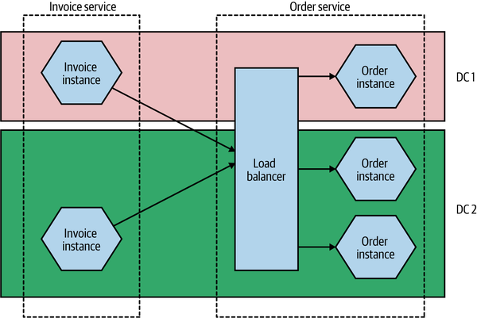
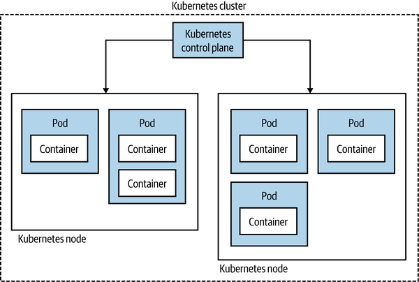

# *Basics*

- Microservices are independently releasable services that are modeled around a business domain.
- A service encapsulates functionality and makes it accessible to other services via networks—you construct a more complex system from these building blocks.
- Information hiding means hiding as much information as possible inside a component and exposing as little as possible via external interfaces.
- Having clear, stable service boundaries that don’t change when the internal implementation changes results in systems that have looser coupling and stronger cohesion.

# Key Concepts

## Independent deployability 
- is the idea that we can make a change to a microservice, deploy it, and release that change to our users, without having to deploy any other microservices.
- loosely coupled microservices
- explicit, well defined, stable contracts between services.

## Modeled Around a Business Domain
- Domain driven design
- By modeling services around business domains, we can make it easier to roll out new functionality and to recombine microservices in different ways to deliver new functionality to our users.
- opposed to layered architecture like MVC.
- high cohesion of business functionality over high cohesion of technical functionality.

## Owning Their Own State
- microservices should avoid the use of shared databases.
- Hiding internal state in a microservice is analogous to the practice of encapsulation in object-oriented (OO) programming.
- avoid backward-incompatible changes   

## size
- keep it small, based on domain boundry and easy to understand.
- with more microservices, comes more complexity and performance issues(latency maybe). -- revisit

## Flexibility
- Microservices **buys** you options. as options have cost.
- flexibility for scale, technical, organization, robustness.
- Think of adopting microservices as less like flipping a switch, and more like turning a dial.
- incremental adoption helps you asses impacts and handle accordingly.

## Alignment of Architecture and Organization
- Organizations which design systems are constrained to produce designs which are copies of the communication structures of these organizations. -  Conway's Law
- A stream-aligned team is a team aligned to a single, valuable stream of work...[T]he team is empowered to build and deliver customer or user value as quickly, safely, and independently as possible, without requiring hand-offs to other teams to perform parts of the work.
- MVC have historically teams build around core competency of people like front end, back end, DBAs.
- in MicroServices world, teams handle microservice built around business capability end to end.

## Monolith
- When all functionality in a system must be deployed together.
- The Single-Process Monolith
    - when all the code is deployed in a single process.
- The Modular Monolith
    - single process consists of separate modules. Each module can be worked on independently, but all still need to be combined together for deployment.
    - One of the challenges of a modular monolith is that the database tends to lack the decomposition we find in the code level, leading to significant challenges if you want to pull apart the monolith in the future.
- The Distributed Monolith
    - A distributed system is one in which the failure of a computer you didn’t even know existed can render your own computer unusable
    - A distributed monolith is a system that consists of multiple services, but for whatever reason, the entire system must be deployed together.
    - A distributed monolith has all the disadvantages of a distributed system, and the disadvantages of a single-process monolith, without having enough of the upsides of either.

- Monoliths and Delivery Contention

- Advantages of monoliths
    - simple deployments, troubleshooting, workflows, end to end testing.
    - easy code reuse,

## Enabling technologies.
As you ramp up your microservice architecture, you should constantly be looking for issues caused by your increasingly distributed system, and then for technology that might help.

- Log Aggregation and Distributed Tracing
    - single centralized place to view logs from all services.
    - You can make these log aggregation tools even more useful by implementing correlation IDs, in which a single ID is used for a related set of service calls.
    - humio, jaeger, lightstep, honeycomb, datadog

- Containers and Kubernetes
    - you want to run each microservice instance in isolation.
    - containers provide isolated execution environments which are small, faster to spin up and cost effective
    - consider when deploying many services, running clusters can take signifincant amount of work.

- Streaming
    - Products that allow for the easy streaming and processing of what can often be large volumes of data have therefore become popular with people using microservice architectures.
    - Apache Kafka kind of defacto standard, apache flink.
    - check out : https://www.gentlydownthe.stream/ 

- Public Cloud and Serverless
    - As your microservice architecture grows, more and more work will be pushed into the operational space.
    - using managed services like EKS, aurora can offload tons of ops tasks.

## Advantages of Microservices
By combining the concepts of information hiding and domain-driven design with the power of distributed systems, microservices can help deliver significant gains over other forms of distributed architectures.

- Technology Heterogeneity
    - With a system composed of multiple, collaborating microservices, we can decide to use different technologies inside each one. This allows us to pick the right tool for each job rather than having to select a more standardized, one-size-fits-all approach that often ends up being the lowest common denominator.
    - With microservices, we are also able to more quickly adopt technologies and to understand how new advancements might help us.

- Robustness
    - with microservices, we can build systems that handle the total failure of some of the constituent services and degrade functionality accordingly.
    - To ensure that our microservice systems can properly embrace this improved robustness, we need to understand the new sources of failure that distributed systems have to deal with. Networks can and will fail, as will machines.

- Scaling
    - With a large, monolithic service, we need to scale everything together.
    - With smaller services, we can scale just those services that need scaling, allowing us to run other parts of the system on smaller, less powerful hardware,

- Ease of Deployment
    - A one-line change to a million-line monolithic application requires the entire application to be deployed in order to release the change
    - This allows us to get our code deployed more quickly. If a problem does occur, it can be quickly isolated to an individual service, making fast rollback easy to achieve. It also means that we can get our new functionality out to customers more quickly.

- Organizational Alignment
    - smaller teams working on smaller codebases tend to be more productive.
    - Microservices allow us to better align our architecture to our organization, helping us minimize the number of people working on any one codebase to hit the sweet spot of team size and productivity.

- Composibility
    - One of the key promises of distributed systems and service-oriented architectures is that we open up opportunities for reuse of functionality.
    - Now we need to think of the myriad ways that we might want to weave together capabilities for the web, native application, mobile web, tablet app, or wearable device.

## Microservice Pain Points

- Developer Experience
    - More resource-intensive runtimes like the JVM can limit the number of microservices that can be run on a single developer machine.
    - Extreme solutions can involve “developing in the cloud,” where developers move away from being able to develop locally anymore.

- Technology Overload
    - The sheer weight of new technology that has sprung up to enable the adoption of microservice architectures can be overwhelming. 
    - You have to carefully balance the breadth and complexity of the technology you use against the costs that a diverse array of technology can bring.
    - Microservices may well give you the option for each microservice to be written in a different programming language, to run on a different runtime, or to use a different database—but these are options, not requirements.

- Cost
    - Atleast in short term, Cost will increase. you’ll likely need to run more things—more processes, more computers, more network, more storage, and more supporting software (which will incur additional license fees)
    - Microservices are a poor choice for an organization primarily concerned with reducing costs, as a cost-cutting mentality—where IT is seen as a cost center rather than a profit center—will constantly be a drag on getting the most out of this architecture.

- Reporting
    - Reporting in simple & straighforward with single databse in monolithic systesms, with microservices this gets tricky with databases seperated/divided in microservices.
    - Need to use new technologies, methodologies for reporting purpose like realtime streaming of data, datawarehouse, datalake etc.

- Monitoring and Troubleshooting
    - Monitoring, logging, troubleshooting, debugging is straightforward/simple in monolith.
    - all these gets difficult & complex in microservices setup.

- Security
    - With a single-process monolithic system, much of our information flowed within that process. Now, more information flows over networks between our services. This can make our data more vulnerable to being observed in transit and also to potentially being manipulated as part of man-in-the-middle attacks. This means that you might need to direct more care to protecting data in transit and to ensuring that your microservice endpoints are protected so that only authorized parties are able to make use of them.

- Testing
    - Automated functional test with great degree of confidence gets complex, hard to achive, time consuming, long running with microservices.
    - microservice architecture, the scope of our end-to-end tests becomes very large.
    - We would now need to run tests across multiple processes, all of which need to be deployed and appropriately configured for the test scenarios

- Latency
    - With a microservice architecture, processing that might previously have been done locally on one processor can now end up being split across multiple separate microservices. Information that previously flowed within only a single process now needs to be serialized, transmitted, and deserialized over networks that you might be exercising more than ever before. All of this can result in worsening latency of your system.

- Data Consistency
    - Shifting from a monolithic system, in which data is stored and managed in a single database, to a much more distributed system, in which multiple processes manage state in different databases, causes potential challenges with respect to consistency of data.
    - eventual consistency, saga can be helpful.

- Adopting an incremental approach to decomposition, so that you are able to assess the impact of changes to your architecture in production, is really important.

- Probably the single biggest reason that organizations adopt microservices is to allow for more developers to work on the same system without getting in each other’s way.

# How to Model Microservices

### Good MicroServices Boundry.
- We want our microservices to be able to be changed and deployed, and their functionality released to our users, in an independent fashion.
- microservices are just another form of modular decomposition, albeit one that has network-based interaction between the models and all the associated challenges that brings.

### Information Hiding
- Hides information behind module boundry.
- benefits of modules with good boundry.
    - Improved development time
    - Comprehensibility
    - Flexibility

### Cohesion
- “the code that changes together, stays together.”
- We want related behavior to sit together, and unrelated behavior to sit elsewhere. so changes in behaviors are contained in one place, independent, fast and easy.

### coupling
- When services are loosely coupled, a change to one service should not require a change to another.
- Cohesion applies to the relationship between things inside a boundary (a microservice in our context), whereas coupling describes the relationship between things across a boundary.
- A structure is stable if cohesion is strong and coupling is low.

- **Types of coupling**
- Domain Coupling 
    - Domain coupling describes a situation in which one microservice needs to interact with another microservice, because the first microservice needs to make use of the functionality that the other microservice provides.
    - largly unavoidable
    - whenever you see a single microservice depending on multiple downstream services in this way, it can be a cause for concern—it might imply a microservice that is doing too much.
    - Just remember the importance of information hiding. Share only what you absolutely have to, and send only the absolute minimum amount of data that you need.

- Pass-Through Coupling
    - “Pass-through coupling” describes a situation in which one microservice passes data to another microservice purely because the data is needed by some other microservice further downstream. 
    - problematic
    - should try to reduce it, removing it may lead to more domain coupling, take balanced approach. try to keep microservices independent, impact of change should be minimum.

- Common Coupling
    - Common coupling occurs when two or more microservices make use of a common set of data.
    - using sharing database, shared memory,shared filesystem
    - Common coupling becomes more problematic, though, if the structure of the common data changes more frequently, or if multiple microservices are reading and writing to the same data.
    - Keep single source of truth and only 1 service should be able to update it.
    - Sources of common coupling are also potential sources of resource contention. Multiple microservices making use of the same filesystem or database could overload that shared resource, potentially causing significant problems if the shared resource becomes slow or even entirely unavailable.

- Content Coupling
    - Content coupling describes a situation in which an upstream service reaches into the internals of a downstream service and changes its internal state.

## Domain-Driven Design
- to identify service boundries.
- concepts :
    - Ubiquitous language : use real-world domain language in code also, so it makes it easier to make sense of the code/system.
    - Aggregate - collection of objects that are managed as a single entity, representing real world concepts.
        - We want to treat aggregates as self-contained units; we want to ensure that the code that handles the state transitions of an aggregate are grouped together, along with the state itself. So one aggregate should be managed by one microservice, although a single microservice might own management of multiple aggregates.
        - The key thing to understand here is that if an outside party requests a state transition in an aggregate, the aggregate can say no. You ideally want to implement your aggregates in such a way that illegal state transitions are impossible.
    - Bounded context 
        - A bounded context typically represents a larger organizational boundary.
        - Internal concerns should be hidden from the outside world, which doesn’t need to know, nor should it care.

### Mapping Aggregates and Bounded Contexts to Microservices
- The aggregate is a self-contained state machine that focuses on a single domain concept in our system, with the bounded context representing a collection of associated aggregates, again with an explicit interface to the wider world.
- aggregates themselves don’t want to be split apart—one microservice can manage one or more aggregates, but we don’t want one aggregate to be managed by more than one microservice.

### Event Storming
- collaborative brain storming exercise with technical & non technical people.

### Domain Driven Design for MicroServices
- Firstly, a big part of what makes DDD so powerful is that **bounded contexts**, which are so important to DDD, are explicitly about hiding information—presenting a clear boundary to the wider system while hiding internal complexity that is able to change without impacting other parts of the system.
- Secondly, the focus on defining a common, **ubiquitous language** helps greatly when it comes to defining microservice endpoints.
 
- Other factors can be used for service boundries as well.
    - volatility : how frequent are changes.
    - data : PI data vs non PI data
    - technologies : diff systems might have diff requirements, like using Rust, C/C++, python
    - Organizational : 

# Splitting the Monolith

### Have a Goal
- MicroServices are not goal. you don't "win" by having the microServices.
- Have clear goal on rational concious decision making.
- Microservices aren’t easy. Try the simple stuff first.
- So be clear about what change you are trying to achieve, and consider easier ways to achieve that end goal before considering microservices. If microservices really are the best way to move forward, then track your progress against that end goal and change course as necessary.

### Incremental Migration
- Take an Incremental Approach, do not go for big bang rewrite.
- start small, implement 1-2 microservices, learn from it and if it is achieving the goals than move ahead.

### Monoliths are not Enemy
- monolithic architecture isn’t inherently bad and therefore shouldn’t be viewed as the enemy.
- Don’t focus on “not having the monolith”; focus instead on the benefits you expect your change in architecture to bring

### The Dangers of Premature Decomposition
- There is danger in creating microservices when you have an unclear understanding of the domain.
- Prematurely decomposing a system into microservices can be costly, especially if you are new to the domain.
- Get the thorough understanding of the domain/application first.
- Having an existing codebase you want to decompose into microservices is much easier than trying to go to microservices from the beginning for this very reason.

### What to Split First?
- Identify what is the goal.
    - Scalability - identify the functionality with constraint and make them seperate services.
    - Time to Market -  use code volatility as a measure. use static analysis tools to do that.
- identify if the compositions are viable, functionality may be deeply intervined and complex, deep. functionality may be very critical and changes are very high risk.
- alternatively, functionality may be already well seperated and clear candidate for migration.
- how easy the extraction is versus the benefit of extracting the microservice in the first place.
- Start with easy ones, learn and adapt. With a few successes and some lessons learned, you’ll be much better placed to tackle more complex extractions, which may also be operating in more critical areas of functionality.

### Decomposition by Layer
- Once Microservice to be migrated is identified, need to decice miration layer by layer. UI, Backend. Data.
- Approaches
    - Code first - can be simple, data is still intact in DB.
    - Data First - It forces you to deal up front with issues like loss of enforced data integrity in your database or lack of transactional operations across both sets of data.

### Useful Decompositional Patterns
- Strangler Fig Pattern
    - describes the process of wrapping an old system with the new system over time, allowing the new system to take over more and more features of the old system incrementally.
    - Intercept call to application, if functionality is migrated to microservice redirect else redirect to mololith.
    

- Parallel Run
    - Running both your monolithic implementation of the functionality and the new microservice implementation side by side, serving the same requests, and comparing the results.

- Feature Toggle
    - A feature toggle is a mechanism that allows a feature to be switched off or on, or to switch between two different implementations of some functionality. 

### Data Decomposition Concerns
When we start breaking databases apart, we can cause a number of issue

- Performance
    - Adds network latency.
    - data is split, RDBMSs are great at Joins, now with data split in multiple split, Joins needs to be done at code layer, single query will be converted to many queries with Joining at code layer, and it won't be nearly efficient as Joins in DB.

- Data Integrity
    - you’ll simply need to get used to the fact that you can no longer rely on your database to enforce the integrity of inter-entity relationships.   
    - with data in different DBs, can not rely on databases data integrity.

- Transactions
    - Traditional monolothic database provides transations integrity, it can be shock when moved from safety of thhis feature.
    - distributed transactions are not only complex to implement, even when done well, but they also don’t actually give us the same guarantees that we came to expect with more narrowly scoped database transaction.
    - Can use saga, but data integrity still suffers to some point.

- Tooling
    - Changing databases is difficult for many reasons, one of which is that limited tools remain available to allow us to make changes easily. IDEs helps with code.
    - LiquiBase is one such tool which helps.

- Reporting Database
    - Data is split, but Reporting still might be needed from diff database combined.
    - With a reporting database, we instead create a dedicated database that is designed for external access, and we make it the responsibility of the microservice to push data from internal storage to the externally accessible reporting database.
    - The second key point is that the reporting database should be treated like any other microservice endpoint,

# Microservices Communication Style.
calls between different processes across a network (inter-process) are very different from calls within a single process (in-process). 
## in-process vs inter-process comminucations.
- Performance:
    - The performance of an in-process call is fundamentally different from that of an inter-process call.
    - Compiler does tons of optimizations/inlining for in-process calls. no such optimizations for inter-process in language.
    - An API that makes sense in-process may not make sense in inter-process situations. 
    - Network overhead, sending data between process, serialization & deserialization.

- Changing Interfaces
    - Straightforward for in-process, easy and deployed in same code.
    - Interface of a microservice also affects consuming services, and backward compatibility/ versioning needs to be taken into consideration.

- Error Handling
    - in-process error handlings is deterministic.
    - for distributed systems like microservices it is not deterministic. Network failures, Container failures, downstream services failures etc.
        - Crash failure - system/service crashed.
        - Ommision failure - response not recieved.
        - time failure - response recieved too late.
        - Response faiure - Wrong response, incomplete response.
        - Arbitary Failure - Byzantine failures.

## Technology for Inter-Process Communication: So Many Choices

## Styles of Microservice Communication
- Synchronous blocking
- Asynchronous non-blocking
- Request-Response
- Event Driven
- common data

- Consider Latency, volume of data to be tranferred, security, context of application, ability to scale while deciding communication style.

### Synchronus Blocking
- With a synchronous blocking call, a microservice sends a call of some kind to a downstream process (likely another microservice) and blocks until the call has completed, and potentially until a response has been received.
- Response is needed for further process, just to make sure command worked and retry if needed
- Simple, easy to reason about.
- Blocking, Resource contention, temporal coupling between services, can make a system vulnerable to cascading issues caused by downstream outages.
- for simple microservices architecture, no larger chain of calls.

### Asynchronous Nonblocking
- With asynchronous communication, the act of sending a call out over the network doesn’t block the microservice issuing the call. It is able to carry on with any other processing without having to wait for a response. 
- Different Style are
    - communication through common data
    - request response - send command and return, downstream sends response, any instance of microservice should be able to handle.
    - event-driven - microservices broadcast event, interested services listen and act accordingly.
- temporal decoupling.
- high level of complexity and various choices

### Communication Through Common Data
- 1 microservice write to some specific location, other read/consume it.
- data lake , data warehouse.
- need persistent data store, flow should be in single direction usually.
- sharing large amount of data.
- common coupling   

### Request-Response Communication
- With request-response, a microservice sends a request to a downstream service asking it to do something and expects to receive a response with the result of the request.
- can be synchronous blocking or asynchronous non blocking.
- Retrieving data from other microservices like this is a common use case for a request-response call.
- Sychronous vs asynchronous
- synchronous - connection is being kept open and response is sent back on same connection, socket mostly.
- asynchonous - using queue, messge broker, send a request on a queue, wait for response on queue, some way to identify response for any request and some form of timeout also. 

### Event Driven comminication.
- Event is a statement that something has occured, it emits the events, not knowing if other microservices consume it/or even about existance of other microservices.
- The event emitter is leaving it up to the recipients to decide what to do.
- An event is a fact—a statement that something happened, along with some information about exactly what happened. A message is a thing we send over an asynchronous communication mechanism, like a message broker. The message is the medium; the event is the payload.
- can be implemented using message brokers like RabbitMQ, be vary of middleware which does to much. keep middleware dumb and keep smarts in endpoints. (**Smart endpoints & dumb pipes**  )
- With a request, we are asking a microservice to do something and providing the required information for the requested operation to be carried out. With an event, we are broadcasting a fact that other parties might be interested in, So what to put in event?
    - Just an ID : in this case downstream services needs to fetch other data from emitting microservices, can lead to barrage of data requests from downstream services.
    - Fully detailed events : Send everything about an event is a event. can lead to hugh amount of transfer, some data should not be accesible by all services, some services recieves tons of extra data it does not need.
- can use combination of event driven and request-response.

---

# *Implementation*

# Microservice Communication
Many options, choose your style, synchronous vs asynchronous, request-response vs event driven.

## Ideal Technology
- Make Backward Compatibility Easy
    - adding new fields should not be breaking change, should be simple to test backward compatibility without prod release.

- Make Your Interface Explicit
    - Interface needs to be explicit.
    -  it should be clear to a consumer of a microservice as to what functionality that microservice exposes. But it also means that it is clear to a developer working on the microservice what functionality needs to remain intact for external parties.
    - explicit schema is good way to ensure this.

- Keep Your APIs Technology Agnostic
    - New tools, frameworks, and languages are coming out all the time, implementing new ideas that can help us work faster and more effectively.
    - Keeping API tech agnostic helps to leverage better technology if needed.

- Make Your Service Simple for Consumers
    - make interface easy to use, hard to misuse.
    - provide simple, effective, performant interface.
    - providing library may be easy, but it is technology specific and increase coupling.

- Hide Internal Implementation Detail
    - We don’t want our consumers to be bound to our internal implementation, as it leads to increased coupling; that in turn means that if we want to change something inside our microservice, we can break our consumers by requiring them to also change
    - Avoid technology that exposes internal details.

## Technology Options
- RPC - SOAP, gRPC
- REST - HTTP rest
- GraphQL - graph databses
- message brokers. - kafka, rabbitMQ, tibco, SQS

## Remote procedure call
- Remote procedure call (RPC) refers to the technique of making a local call and having it execute on a remote service somewhere.
- make remote call looks like local call
- have explicit schema, most of the time using interface defination language(IDL).
- RPC frameworks have fixed serialization protocol(gRPC - protocol buffer), provides you choice with networking protocol.
- The ease of generation of client-side code is one of the main selling points of RPC
- challenges:
    - technology coupling : RPC technology sometimes comes with restrictions on interoperability. 
    - Brittleness : key challenge with any RPC mechanism that promotes the use of binary stub generation: you don’t get to separate client and server deployments.
- gRPC seems best choice for RPC currently. good fit when you have control of client and server side code.

## REST
- Representational State Transfer (REST) is an architectural style inspired by the web.
- Concept of resource is a most important thing in REST.
- internal & external representation of a resource is decopupled.
- REST & HTTP
    - HTTP works well with REST. HTTP is not REST.
    - provides useful clear specification with verbs like GET, POST etc.
    - have great tooling ecosystem and security specifications.

- hypermedia as the engine of application state
    - Hypermedia is a concept wherein a piece of content contains links to various other pieces of content in a variety of formats (e.g., text, images, sounds).
    - client interacts with hypermedia links. like shopping cart symbols.
    - decouples client & server almost completly. 
    - rarely used.

- Challenges
    - ease of consumption, no way to generate client code similar to RPC.(have OpenAPI specificatio now.)
    - Performance - sending data over HTTP takes network bandwidth and time, not as lean as binary protocols of thrift and gRPC.
- REST over HTTP is a sensible default choice for service-to-service interactions.
- REST-based APIs excel in situations in which you want large-scale and effective caching of requests.
- obvious choice for exposing APIs to external client.

## GraphQL
- In recent years, GraphQL has gained more popularity, due in large part to the fact that it excels in one specific area. Namely, it makes it possible for a client-side device to define queries that can avoid the need to make multiple requests to retrieve the same information. This can offer significant improvements in terms of the performance of constrained client-side devices and can also avoid the need to implement bespoke server-side aggregation.
- Challenges 
    - For one, the client device can issue dynamically changing queries, and I’ve heard of teams who have had issues with GraphQL queries causing significant load on the server side as a result of this capability.
    - caching is complex & difficult due to dynamic nature of queries.
    - does not handle writes well.
    - it’s essential that your GraphQL API isn’t coupled to the underlying datastores of your microservices.
- Fundamentally, GraphQL is a call aggregation and filtering mechanism, so in the context of a microservice architecture it would be used to aggregate calls over multiple downstream microservices. As such, it’s not something that would replace general microservice-to-microservice communication.

## Message Brokers
- Message brokers are intermediaries, often called middleware, that sit between processes to manage communication between them.
- Topics & Queue
    - Queue - point to point, request-response, sender knows about reciever, can have consumer group(multiple instance of service reading from same queue, competing consumer pattern).
    - Topic - multiple consumer can subscribe to topic, each will recieve a message, asynchronous, event driven.
    - Topics are a good fit for event-based collaboration, whereas queues would be more appropriate for request/response communication
- Guaranteed delivery 
    - From the point of view of the microservice sending the message, this can be very useful. It’s not a problem if the downstream destination is unavailable—the broker will hold on to the message until it can be delivered.
    - they need some sort of clustered setup with low latency to deliver this.
- other features like exactly once delivery, ordering, etc needs to be taken into consideration.
- RabbitMQ, ActiveMQ, TIBCO, Kafka, SQS, kinesis
- Kafka have very good scalability functionality, message permanance, streaming capabilities.

## Serialization Formats
- Text - XML, JSON
- Binary - protocol buffer - compact, 

## schema
- explicit schema is helpful in keeping things well documented and compatibility.
- Structural Versus Semantic Contract Breakages
    -  A structural breakage is a situation in which the structure of the endpoint changes in such a way that a consumer is now incompatible.
    -  semantic breakage refers to a situation in which the structure of the microservices endpoint remains the same but the behavior changes in such a way as to break consumers’ expectations.

## Handling Change Between Microservices
- Avoiding Breaking Changes
    - expansion changes - add, do not remove
    - explicit schema -
    - tolerant reader -
    - right tech
    - catch breakages early

- Managing Breaking Changes
    - lockstep deployment - deploy consumer/producer at same time. independent deployability lost.
    - coexist multiple micro service version - gets problematic with longer time.
    - emulate the old interface  - 

## DRY and the Perils of Code Reuse in a Microservice World
- Sharing Code via Libraries
    - it may lead to many microservices to be redeployed due to change in library for one microservice.
    - alternatively, you can keep library as part of deployment in micorservices and update them as needed, leading to some duplication and out of sync with diff versions existing.

## Service Discovery
- find what services and APIs are available.

## DNS 
- associate name with the IP of one or more machines. use load balancer.
- services deployments update the entries.
- can use templates based on service and environment to identify services.
- well understood and supported.
- DNS have TTL so and due to caching some client may refer to older instances which are destroyed, best to use load balancer and DNS point to load balancer.

## Dynamic Service Registries
- The downsides of DNS as a way of finding nodes in a highly dynamic environment have led to a number of alternative systems, most of which involve the service registering itself with some central registry, which in turn offers the ability to look up these services later on.
- ZooKeeper 
    - clustered system to provide various services like configuration, data sync, leader election etc.
    - ZooKeeper provides a hierarchical namespace for storing information
- Consul 
    - supports config management & service discovery.
    - Have inbuilt DNS capabilities.
    - Consul uses a RESTful HTTP interface for everything from registering a service to querying the key/value store or inserting health checks.
- etcd and kubernetes
    - **etcd**, a configuration management store bundled with Kubernetes. etcd has capabilities similar to those of Consul, and Kubernetes uses it for managing a wide array of configuration information.
    - default choice if everything runs in kubernetes.

## Service Meshes and API Gateways
- Speaking generally, an API gateway sits on the perimeter of your system and deals with north-south traffic. Its primary concerns are managing access from the outside world to your internal microservices. A service mesh, on the other hand, deals very narrowly with communication between microservices inside your perimeter—the east-west traffic.
- Put (very) simply, service meshes and API gateways can work as proxies between microservices. This can mean that they may be used to implement some microservice-agnostic behavior that might otherwise have to be done in code, such as service discovery or logging.

    

## API gateway
- Being focused more on north-south traffic, the API gateway’s main concern in a microservices environment is mapping requests from external parties to internal microservices.
- also provide features like rate limiting, API keys for external parties, logging, reverse proxies.
- use features you need.
- kubernetes needs something like this, as it does not handle networking outside cluster.
- AWS API gateway, ambassdor - specially built for this.
- Avoid using it for call aggregation or protocol rewriting, keep pipes dumb.
- do not use it for interservice communication, it adds network hop which is not required.

## service meshes
- With a service mesh, common functionality associated with inter-microservice communication is pushed into the mesh. This reduces the functionality that a microservice needs to implement internally, while also providing consistency across how certain things are done.
- Making it easy to implement common behavior across microservices is one of the big benefits of a service mesh.
- they provide mutual TLS, correlation IDS, service discovery, load balancing etc.
- clustered, use proxies on same machine as service, ccontrol panel helps with TLS.
- uses lightwieght envoy proxy to implement.
- used with kubernetes mostly.
- only needed with large number of micro services.
- istio, spyder mesh

- API gateway and service mesh works well with REST HTTP, not much with other protocols.

# Workflow
- how to do distributed transactions for business process.

## Database transactoins
- do multiple things as a single operation, all or nothing.
- relational Databases provide ACID transactions.
    - Atomicity, consistency, isolation, durability.
- changes to single database in single microservices are still ACID, but normally to support any operation changes to be carried out by more than 1 service. it gets tricky to get it right.
## Distributed transactions - 2 phase commit
- The two-phase commit algorithm (sometimes shortened to 2PC) is frequently used in an attempt to give us the ability to make transactional changes in a distributed system, where multiple separate processes may need to be updated as part of the overall operation.
- vote phase - all services involved in operation confirm if they can make the changes. if yes locks rows. if any of the service do not agree, abort and unlock the rows
- commit phase -  if services agree, commit changes, unlocks rows.
- very difficult and error prone to achieve. isolation is lost from ACID, deadlocks, latency, performance hits.
- Avoid distributed transactions due to reasons above.
- Google spanner achieved successful distributed transaction.
[Spanner](https://www.youtube.com/watch?v=iKQhPwbzzxU&ab_channel=Devoxx)

## Sagas
- Unlike a two-phase commit, a saga is by design an algorithm that can coordinate multiple changes in state, but avoids the need for locking resources for long periods of time. A saga does this by modeling the steps involved as discrete activities that can be executed independently. 
- handle long lived transactions.
- break down LLT into sequqnce of transactions, each of which can be handled independently.
- We can break a single business process into a set of calls that will be made to collaborating services—this is what constitutes a saga. still not ACID accross services or databases.
    
- Failure modes:
    - Backward recovery : rollback, how to revert completer operations.
        - not similar to rollback in ACID transaction, you do *compensating transaction* for every step in saga, design saga such that rollbacks are smooth and there are need for limited compensating transactions
    - forward recovery : pickup from failure and try to procees ahead. do retries.
- It’s really important to note that a saga allows us to recover from business failures, not technical failures.
- can mix backward and forward recovery depdending on saga/business operations.

## implementing sagas
- Orchestrated sagas
    - Orchestrated sagas use a central coordinator (what we’ll call an orchestrator from now on) to define the order of execution and to trigger any required compensating action. 
    - one of the services can be orchastrator for a saga, it leads to domain coupling, do not over centralize, diff sagas can have diff micro services as a orchestrator.
- choreographed saga    
    - A choreographed saga aims to distribute responsibility for the operation of the saga among multiple collaborating services.
    - trust but verify approach
    - services trigger events and other reacts approproately.

# Build

## Continuous integration
- checkin & merge changes continuously, run some unit tests, static analysis & run tests against the deployment, manage artifacts for builds.
- CI
    - merge to master once a day
    - run tests against the build
    - fixing broken build should be priority #1, no checkins till build fixed.
    - Branching
        - branch based developement - feature branches, isolated, delayed integration
        - trunck based development - everyone checkin to trunk, frequent integration, use feature flag for imcomplete work.
    - short-lived branches; small, readable patches; and automatic testing of changes make everyone more productive.
- Build pipelines & continuous delivery
    - have a build pipeline wit seperate stages.
    - if candidate passsed all stages it is ready to release.
    - each checkin goes through pipeline to check for readines.
    - continuous delivery vs continuous deployment.
    - need unit tests, automated functional tests, security scans, static analysis, sonar scans, code coverage scans, performance tests, regression tests. etc.
- Tooling
    - use tooling with built in CD support.
    - fast feedback vs production like env.
- Artifacts
    - Build your deployable artifact once and once only, and ideally do it pretty early in the pipeline.

## Mapping Source Code and Builds to Microservices
- diff strategies to handle code
- one repo per microservice 
    - how to handle shared code?
    - how to handle if changes in multiple services needs to be deployed atomically.
    - if you need to make changes in multiple repos for single change frequently, revisit your boundries.
- monorepo
    - all the code in same repo.
    - builds triggered based on dir structure.
    - many commits triggering same builds get complecated.
    - google uses it with bazel to manage this.

# Deployment

## Logical to Physical
This logical view of our microservices can hide a wealth of complexity when it comes to actually running them on real infrastructure

### Multiple instances
- for scalability, reliability, fault tolerance we might have multiple instance running on diff hardware.

### Database
- diff instance of same microservices use the same databse, diff microservice use diff database.
- database also needs to scaled, and replicated for resiliency. we usually have single write instance and multiple read replicas , and DR facility with similar setup.
- The important thing to realize here is that although these two databases might be run from the same hardware and database engine, they are still logically isolated databases. but common db failure can lead to multiple service failures.
- offerings like AWS RDS/Aurora can help with having diff dbs for diff services.

### Environments
- Org would have local, CI, QA,UAT, prod env.
- Ideally, each environment in this process would be an exact copy of the production environment. This would give us even more confidence that our software will work when it reaches production. However, in reality, we often can’t afford to run multiple copies of our entire production environment due to how expensive this is.
- exact topology of your microservice will change from environment to environment.

- So, to summarize, a single logical microservice can be deployed into multiple environments. From one environment to the next, the number of instances of each microservice can vary based on the requirements of each environment.

## Principles of Microservice Deployment

### Isolated Execution
- Run microservice instances in an isolated fashion such that they have their own computing resources, and their execution cannot impact other microservice instances running nearby.
- running many microservices in same server/VM can lead to many complexities like, how to tune, how to monitor usage, how deployment will affect other services, dependencies. avoid it.
- can use seperate hosts, virtualization, containers for isolation.

### Automation
- MicroServices bring much complexity in Ops space, diff config, diff number of instances, deployments etc.
- Doing things manually killer for productivity and needs ton of people to do Ops work.
- Embrace Automation.

### infrastructure as code 
- infrastructure as code (IAC) is a concept whereby your infrastructure is configured by using machine-readable code.
- using code for Infra, we can have version controlled, well tested and repeatable deployments/repave.

### Zero downtime deployment
- very important, pre-requisite for scalling hugh number of microservices.
- The goal here is that upstream consumers shouldn’t notice at all when you do a release.
- should be part of architecture/design from start, tools like kubernetes help, but overkill just for this purpose.

### Desired State Management
- Desired state management is the ability to specify the infrastructure requirements you have for your application, and for those requirements to be maintained without manual intervention.
- kubernetes is good for container based system, it handles failure, kills for you.
- Nomad handles other system apart from just container based setup.
- prerequisites:
    - automated deployment of microservice instance.
- GitOps : combiner IaC and desired state management.

## Deployment Options
- We want the tooling we pick to allow us to embrace a culture of automation, define our infrastructure and application configuration in code, and ideally also manage desired state for us.

- Physical machines - not used with microservices.
- Virtual Machines 
    - Fundamentally, virtualization allows you to split up an underlying machine into multiple smaller “virtual” machines that act just like normal servers to the software running inside the virtual machines.
    - Each virtual machine contains a full operating system and set of resources that can be used by the software running inside the VM.
    - use hypervisor, diminishing return on making vms smaller ans smaller
    - easy to scale, desired state management, 0 down time deployment takes work.
- containers 
    - no hypervisor, runs on the same kerrnal as Host.
    - lightweight than VMs, starts quickly.
    - Rather than managing processes directly, you can think of a container as an abstraction over a subtree of the overall system process tree, with same kernal.
    - Need some way to route to underlying containers when multiple containers running on host.
    - isolation weaker than VMs.
    - Windows containers : supported only after windows server 2016, cut down Os windows Nano, windows OS is hugh, so container running windows are also big.
    - Docker : introduces containers as they today are, with handling networking, registry and concept of container images.

- Platform as a service
    - Higher level of abstration than single host.
    - provide functionality to run appliation, manages auto scalling etc.
    - Heroku, netlify

- Function as a service
    - no need to manage infra/machines, serverless.
    - AWS Lambda, just upload the code, function is triggered on event, pay for only what you use.
    - FaaS a great option for situations in which you have low or unpredictable load.
    - runs containers internally, limited options for language runtime, configuration/specs of function.
    - functions are stateless
    - challenges
        - small runtime, stateless, cold start "long spinup time"
    - with FaS, microservices may be logical construct, instead of physical deployment as multiple functions part of same microservice can be deployed seperately.
    - be careful with going to fine grained deployments.

- don't let fashion dictate your tech solutions.

## Kubernetes and Container Orchestration
- Docker handles how containers are created, we need to run containers on multiple machines for scalling, redundancy etc/
- Container orchestration platforms handle how and where container workloads are run.
- manage desired state, how workloads are distributed, optimizing for resource utilization.

### Kubernetes
- container orchestration, k8s is goto offerings, below are useful concepts.
- cluster - kubernetes cluster handles everything inside kubernetes.
- nodes - where workloads run
- control plane - which controls/manages worker node.
- pods - unit of deployment, conitainer runs inside pod, mostly single container in 1 pod. pods run inside nodes.
- service - routing endpoint for pods, way to map pods to stable network interface.
- replica sets - define desired state of pods, i.e 4 instances 
- deployments - A deployment is how you apply changes to your pods and replica sets. 
    
- So, to deploy your microservice, you define a pod, which will contain your microservice instance inside it; you define a service, which will let Kubernetes know how your microservice will be accessed; and you apply changes to the running pods using a deployment.

#### multitenancy and federation 
- kubernetes do not have inbuilt facility to handle multitenancy, tools like openshift help if needed. extra thing to learn on top of complex k8s.
- federation is when multiple clusters of kubernetes are run, and some federation machanism is on top of that. non trivial to handle, capacity is still managed per cluster.

- One area of continuing confusion in the space of Kubernetes is how to manage the deployment and life cycle of third-party applications and subsystem
- Helm and Operator help with this.

- managing k8s cluster is a complex, time consumig task, so if you have few developers and few microservices, avoid it.

## Progressive Delivery
- deployment and release is not same, service may be deployed to production but may not be made available to end-uses, things like blue-green, canary, feature toggle are progressive delivery mechanism.
- helps with testing, with frequent delivery and low error rates.
### feature toggle
- features can be turned on/off with flags, can be on for some users and off for others.
- can be hadnled in simple config files.

### canary release  
- with a canary rollout the idea is that a limited subset of our customers see new functionality. If there is a problem with the rollout, then only that portion of our customers is impacted. If the feature works for that canary group, then it can be rolled out to more of your customers until everyone sees the new versio
- spinaker can do it,

### paraller runs
- you run two different implementations of the same functionality side by side, and send a request to the functionality to both implementations. 

# Testing

## Type of  Tests

- you will want functional automated tests of different scope for different purposes. unit tests, service tests, UI tests(end to end) with each scope increase and feedback cycle goes longer, but confidence in system also increse.
- Unit test : test single method/function mostly, tech facing, fast feedback cycle, runs quickly, limit network/db connection, external data/file reading. fast and helps in refactoring.
- Service test : test individual micro service, bypass UI. limited scope, time can increase if we use real network, db connection. failure identification more complex than unit tests.
- end to end tests: done using UI, test entire systems, gives high level of confidence.

- Service test - tests individual micro service, stub/mock downstream microservices for testing purpose.
- Implementing End-to-End Tests
    - having multiple services to be deployed for testing each microservice can be cumbersome & costly, use combined common end to end test step in pipeline of services. deployment of any service trigger the end to end tests.
    - Brittle and flaky tests
        - as we have more and more moving parts, test failures can be due to some parts other than service it self, like network failure etc. it is hard to pin point failure.
        - we can get flaky tests which runs sometime, and fails sometime, this is bad condition to be in, do not have flaky tests.
- end to end tests take longer to run, failed tests impact developers ability to checkin, hat are flaky and britte, no clear ownership of who owns/ does end to end testing, we lose independant testability.

### Contract Tests and Consumer-Driven Contracts (CDCs)
- With contract tests, a team whose microservice consumes an external service writes tests that describe how it expects an external service will behave.
- Consumer driven contracts useful to identify breaking changes with changes in producer services. specify how consumer expect producer to behave.
- Pact is a tool to define CDCs.

- do in production testing, but make sure this does not affect actual production system stability. canary release, smoke testing etc.

### Mean time to repair, Mean time between faiures.

### Cross-Functional Testing
- Nonfunctional requirements like latency, concurrent active users, security 
- Performance tests
- Robustness Tests - A microservice architecture is often only as reliable as its weakest link

# Observability 
- You won’t truly appreciate the potential pain, suffering, and anguish caused by a microservice architecture until you have it running in production and serving real traffic.
- We now have multiple servers to monitor, multiple log files to sift through, and multiple places where network latency could cause problems.

## Observability Versus Monitoring
-  The observability of a system is the extent to which you can understand the internal state of the system from external outputs.
- Observability is the extent to which you can understand what the system is doing based on external outputs. Logs, events, and metrics might help you make things observable, but be sure to focus on making the system understandable rather than throwing in lots of tools.
- When it comes to making your system observable, think about the outputs you need from your system in terms of events that you can collect and interrogate. You might need to use different tooling to expose different types of events right now, but that may not be the case in the future.

## Building Blocks for Observability
### Log Aggregation
- we’re looking to use specialized subsystems to grab our logs and make them available centrally.
- Processes (like our microservice instances) log to their local filesystem. A local daemon process periodically collects and forwards this log to some sort of store that can be queried by operators. 
- you should view implementing a log aggregation tool as a prerequisite for implementing a microservice architecture.
- Have a standard format for log, so it can be parsed, extracted, filtered
- correlating log lines
    - when a single call/request being handled by multiple downstream service/generate event for multiple services, identifying a failure can be really tricky.
    - Having co-relation IDs can be really helpful to track single request accross multiple services.
    - Once you have log aggregation, get correlation IDs in as soon as possible. Easy to do at the start and hard to retrofit later, they will drastically improve the value of your logs.
- timing
    - we cannot guarantee that the clocks on these different machines are in sync.
    - clock skew can skrew up timings in logs when diff microservices are running in diff machines.
- A popular open source toolchain for log aggregation has been to make use of a log forwarding agent like Fluentd to send logs to Elasticsearch, using Kibana as a way to slice and dice the resulting stream of logs.
- Options - Humio, ElasticSearch- Kibana, datadog, splunk, AWS CloundWatch, Azure Insights
- Logs can take Hugh space/memory & can cost much based on tooling you are using.

### Metrics Aggregation
- The secret to knowing when to panic and when to relax is to gather metrics about how your system behaves over a long-enough period of time that clear patterns emerge.
- We want metrix for our complex system at bird-eye- view and granualar level both, metrices at system level, all instances of microservices level & individual service level.
#### Low versus high cardinality    
- The more potential fields we might want to query of our data, the higher the cardinality we need to support.
- Systems built to handle low-cardinality data will be very difficult to retrofit to support high-cardinality storage and processing.
- Prometheus, Graphite, HoneyComb,
-  Log aggregation platforms, distributed tracing tools, alerting systems—they all are mission-critical applications that are just as vital as our own software, if not more so. 

### Distributed Tracing
- understanding the wider context in which this information has been captured can be key.
- when wanting to understand how our system is actually behaving in a production environment, that we are able to see the relationships between our microservices. 
- Local activity within a thread is captured in a span. These individual spans are correlated using some unique identifier. The spans are then sent to a central collector, which is able to construct these related spans into a single trace.
- each span contains a start and end time, a set of logs associated with the span, and an arbitrary set of key-value pairs to help with later querying.
- local sampling agent runs alongside service
- OpenAPITracing, honeycomb, Google Dapper, honeyComb, LightStep, OpenTelemetry is new standard
- The idea here is to capture enough information to understand what our system is doing but not capture so much information that the system itself cannot cope.

### System Health
- As things become more complex, it becomes increasingly important to take a step back and think about things from a different vantage point.
- SLA (service level agreement)
- SLO (Service Level Objective) (what team agree to provide)
- SLI (service level indicaters)
- Error Budget - Error budgets are an attempt to avoid this problem by being clear about how much error is acceptable in a system.

### Alerting
- As your sources of potential issues increase, you’ll need to get better at prioritizing what things cause what types of alerts.
- keep alerts Relevant, unique, diagnostic, timley, prioterized, focusing, advisory, understandable

### Semantic monitoring
- With semantic monitoring, we are defining a model for what the acceptable semantics of our system are

### Testing in Production
- synthetic transaction
- A/B testing
- canary release
- parallel run
- smoke tests
- chaos engineering

- use tools which are right fit for your scale, usable by everyone, provides real time data

# Security
- Micorservices Architecture increases surface area for the attack, at same time give us chance to tackle security in-depth with more granual/restricted access, and ability to reduce area of impact.
## Core Principals
### Principal of least privilege
- When granting application access to individuals, external or internal systems, or even our own microservices, we should pay careful attention to what access we grant.
- The principle of least privilege describes the idea that when granting access we should grant the minimum access a party needs to carry out the required functionality, and only for the time period they need it.
### Defense in depth
- Having only one protection mechanism is a problem if an attacker finds a way to breach that defense, or if the protection mechanism defends against only certain types of attackers
- Preventive, detective, responsive defense control

### automation
- We can use it to revoke and rotate security keys and also make use of tooling to help detect potential security issues more easily.

### Build Security into the Delivery Process
- should not be an afterthought.
- We need to ensure that developers have a more general awareness of security-related concerns, that specialists find a way to embed themselves into delivery teams when required, and that tooling improves to allow us to build security-related thinking into our software.
- Tools like Raven, Sonar Scan, Black duck, OSS scan etc.

## The Five Functions of Cybersecurity
- *Identify* who your potential attackers are, what targets they are trying to acquire, and where you are most vulnerable.
- *Protect* your key assets from would-be hackers.
- *Detect* if an attack has happened, despite your best efforts.
- *Respond* when you’ve found out something bad has occurred.
- *Recover* in the wake of an incident.

## Foundation of Application security   

### Credentials
- user credentials
- secrets
    - certificates for TLS
    - SSH keys
    - public/private API keys
    - database tokens
    - creation, distribution, storage, monitoring, rotation of secrets.
    - AWS secrest manager, Hashicorp Vault
- Least access possible
- Patching 
    - timely patching of OS, drivers, third party libraries are extremly importatn.
- Backups
    - Schrodenger's backup 
    - be sure by regularyle restoring your backup
- Rebuild
    - The ability to simply wipe a server from existence and totally rebuild can be incredibly effective not just in the wake of a known attack but also in terms of reducing the impact of persistent attackers.
### Implicit Trust Versus Zero Trust
- Implicit trust
    - every call inside org perimeter is trusted, not recommended.

- Zero Trust
    - idea is that if you operate under the assumption that you are operating in a hostile environment in which bad actors could already be present, then you have to carry out precautions to make sure that you can still operate safely.

### Securing Data
- Data in Transit
    - server identity
    - client identity
    - visibility of data
    - manipulation of data

- Data at Rest
    - make sure data in encrypted, keys are stored securly somewhere else.
    - make sure backup is also encrypted.
    - store only whats needed.

### Authentication and Authorization
- Authentication is the process by which we confirm that a party is who they say they are.
- Authorization is the mechanism by which we map from a principal to the action we are allowing them to do
- Service-to-Service Authentication
    - use mutual TLS, API hash key etc.
- Human Authentication
    - MFA - multifactor authentication
- Single Sign-On 
    - When a principal tries to access a resource (like a web-based interface), they are directed to authenticate with an identity provider. The identity provider may ask them to provide a username and password or might require the use of something more advanced like MFA. Once the identity provider is satisfied that the principal has been authenticated, it gives information to the service provider, allowing it to decide whether to grant them access to the resource.
    - OpenID Connect, LDAP, Active Directory, SAML, 
- Confused deputy problem 
    - if user has access to some service, but not to some downstream service, implicit trust can cause issues.
- centralized authorization
    - all required authentication in upstream service/sso gateway. makes independent deployability difficult. avoid
- Decentralizing authorization 
    - JWT(JSON Web Tokens) : JWTs allow you to store multiple claims about an individual into a string that can be passed around. This token can be signed to ensure that the structure of the token hasn’t been manipulated, and it can also optionally be encrypted to provide cryptographic guarantees around who can read the data
    - Good way to handle decentralized authorization, best to generate JWT token on request basis.
    - challenges
        - Public key management for microservices to decode JWT
        - expiration of token for long running requests.

# Resiliency
- the prospects of improving the resilience of their service offerings is cited as a major reason for chosing microservice architecture.

### Robustness 
- Handling expected perturbations/scenarios like network error, host goes down, service goes down etc.

### Rebound
- How well we recover—rebound—from disruption is a key part of building a resilient system.
- Put systems in place for outage, have tested backups etc.

### Graceful Extensibility
- Handle unexpected scenarios.
- our ability to gracefully extend our system, to handle surprise, comes from having people in place with the right skills, experience, and responsibility to handle these situations as they arise.

### Sustained Adaptability
- That we haven’t yet suffered from a catastrophic outage doesn’t mean that it cannot happen. We need to challenge ourselves to make sure we are constantly adapting what we do as an organization to ensure future resiliency. 
- chaos engineering
- continuing investment in innovation, learning what we do not know.

### Failure is everywhere
- Disks can fail, network can be down, host can be down.
- with scale failures are statistical certainity.
- Understanding the things that are likely to fail is key to improving the robustness of our system.

### Design as per your requirements
- Know exactly what your requirements are, Amazon needs 0 down time, internal reporting tool does not.
- Response time/latency 
- Availability
- Durability of Data 

### Degrading Functionality
- An essential part of building a resilient system, especially when your functionality is spread over a number of different microservices that may be up or down, is the ability to safely degrade functionality.
- for monoliths, system health is binary, up or down. for microservices architecture, one seervice being unavailable should not put entire system to halt, system should work with some degradation.

## stability patterns
- systems that just act slow are much harder to deal with than systems that just fail fast. In a distributed system, latency kills.

### Timeouts
- How long can i wait before giving up on call to downstream service. too long cause system slow sown, too short cause frequent failure as some calls might work in some time. No timeouts can bring entire system to halt.
- Time-outs are incredibly useful. Put time-outs on all out-of-process calls, and pick a default time-out for everything. Log when time-outs occur, look at what happens, and change them accordingly. Look at “normal” healthy response times for your downstream services, and use that to guide where you set the time-out threshold.
- Don’t just think about the time-out for a single service call; also think about a time-out for the overall operation, and abort the operation if this overall time-out budget is exceeded.

### Retries
- some issues with downstream services might be temporary, retries can help.
- identify in which cases, retry make sense.

### Bulkhead
- lose the part of the system, keep rest intact incase of failure.
- for example, have seperate worker pools for diff service, so failing service can be isolated.
- They can also give you the ability to reject requests in certain conditions to ensure that resources don’t become even more saturated; this is known as load shedding.

### circuit breaker 
- We can think of our circuit breakers as an automatic mechanism to seal a bulkhead, not only to protect the consumer from the downstream problem but also to potentially protect the downstream service from more calls that may be having an adverse impact. 
- With a circuit breaker, after a certain number of requests to the downstream resource have failed (due either to error or to a time-out), the circuit breaker is blown.
- ability to manually open/close circuit breaker should be there.

### isolation
- Isolated services do are not affected by one another.
- logical & physical isolation.
- can have isolation with seperate db infra, running on diff hosts, using messge brokers for temporal decoupling, but all of this increase complexity and cost, decide on balance.
- Deciding on the acceptable trade-offs around isolation versus cost and increased complexity, like so many other things, can be vital.

### Redundancy 
- Having more than one microservice instance makes sense as it allows you to tolerate the failure of one of those instances and still have a chance of delivering the required functionality.
- Having more copies of something can help when it comes to implementing redundancy, but it can also be beneficial when it comes to scaling our applications to handle increased load.

### MiddleWare
- So using middleware like message brokers to help offload some robustness concerns can be useful, but not in every situation. 

### Idempotency
- In idempotent operations, the outcome doesn’t change after the first application, even if the operation is subsequently applied multiple times.

## Spreading your Risk
- do not put all your eggs in single basket, use multi AZ, multi region as per your needed, make sure all your services are not in single virtual or physical host.
- Avoid single point of failures, like SAN is very robust but can fail once in a blue moon, prepare for that.
- check and well understand SLAs of your cloud providers, have backup plans ready in case of cloud provider failures.

## CAP theorom
- consistency, availability, partition tolerance.
- As microservices are distributes systems, we mostly have partitions so choose availability or consistency in case of system is partitioned
### sacrifice consistency**
- **AP systems**
- our system is still available in that both nodes are able to serve requests, and we have kept the system running despite the partition, but we have lost consistency;
- systems that are happy to cede consistency to keep partition tolerance and availability are said to be eventually consistent

### scarificing availability
- **CP Systems**
- if system is partitioned and network is down, replication is not working, so we do not respond to request, system is consistent but we lost availability.
- Consistency across multiple nodes is really hard.

- distributed systems are partitioned by nature, so partition tolerance is needed by default, no CA distributed systems.

- it's not all or nothing, you can chosse nuanced AP or CP capabilities for individual microservices based in requirements and as always everything is a trade-off.

## chaos engineering
- Chaos Engineering is the discipline of experimenting on a system in order to build confidence in the system’s capability to withstand turbulent conditions in production.
- Game Days
    - when disasters failures are simulated for system in surprise attack kind of fashion, this goes beyond just tech and key people are also removed.

- production experiment
    - simulate failures in production, famous chaos monkey in netflix
        - simian army - system for chaos engineering at netflix
            - chaos monkey - kill Ec2.
            - chaos gorrila -  shutdown AZ
            - Latency monkey - introduce delay in network
        - chaaos toolkit, gremlin
        
- The problem with blaming people in the aftermath of incidents like this is that what starts as a short-term passing of the buck ends up creating a culture of fear, where people will be unwilling to come forward to tell you when things go wrong.
- strive to have Blameless postmortem and a just culture.

# Scaling
- We do Scale to improve performance or Robustness.
## The Four Axes of Scaling
- The Art of Scaling breaks scaling down into three categories that in the context of computer systems cover functional decomposition, horizontal duplication, and data partitioning.
    - Vertical scaling - get a bigger machine
    - horizonatal scaling - get more machines to do same work
    - data partitioning -  dividing work based on attribute of data
    - functional decomposition - seperation based on type of work - microservices.

### Vertical scaling 
- means buying bigger machine, more capacity, more rams, more I/O throughput, it can reach its limits, take time to aquire in pre-cloud era and cost significantly.
- In bare metal or virtualized on prem systesm scaling up can take time and prove to be really costly.
- with public cloud you can easily get more powerful machines for your needs for the small timeframe you need.
- you do not need any change in system for this kind of scaling and it is pretty fast with cloud.
- does not help with robustness, costly, and if larger system just adds more cores and your app does not use multi-core speedup, might not be very useful.

### Horizontan duplication
- With horizontal duplication, you duplicate part of your system to handle more workloads
- Probably the most obvious form of horizontal duplication that comes to mind is making use of a load balancer to distribute requests across multiple copies of your functionalit.
- *Load balancer* capabilities differ, but you’d expect them all to have some mechanism to distribute load across the nodes, and to detect when a node is unavailable and remove it from the load balancer pool.
- *Competing consumer pattern*, multiple instances read from same queue.
- *Read Replicas* - in read heavy systems keep multiple read replicas behind load balancer, and free up resources to handle writes in primary node.
- Assuming the work can be easily spread across the duplicates, it’s an elegant way of spreading the load and reducing contention for raw computing resources.
- Much of the work here is in implementing your load distribution mechanisms.
- sticky session load balancing.

### Data Partitioning
-  Data partitioning requires that we distribute load based on some aspect of data—perhaps distributing load based on the user.
- Key is mapped to partition/shard. database schema is same, but data is distinct.
- easy if database tech supports if out of the box.
- customer should be unaware of the data partition fact.
- Data partitioning scales really nicely for transactional workloads. If your system is write-constrained, for example, data partitioning can deliver huge improvements.
- does not help with robustness.
- getting partition machanism can be tricky, we need even distribution.
- kafka and cassandra handles this well.
- Queries accross multiple shards needs to be handled differently, using caching maybe.

### functional decomposition
- extract functionality and scale it independently,--> microservices.
- diff microservices have diff requirements, and we can handle each individually.
-  Ability to rightsize the infrastructure required to run these workloads gives us more flexibility around optimizing the cost of the infrastructure we need to run the system.

- it often makes sense to scale our application along multiple axes, depending on our need.

## Start Small
- *premature optimization is root of all evil.*
- Even if you think you have identified a bottleneck, a process of experimentation is essential to make sure that you are right and that further work is justified.
- Do small automated tests to confirm your findings.

- CQRS - command query responsibility segregation, handled inside microservices, diff model & process for reads & writes, difficult to implement well, increase cognitive load.

## Caching
- Caching is a commonly used performance optimization whereby the previous result of some operation is stored so that subsequent requests can use this stored value rather than spending time and resources recalculating the value.
- cache hit, cache miss, cache invalidation.
-  We can cache to help improve the performance of our system as part of helping reduce latency, to scale our application, and in some cases even to improve the robustness of our system.

### for performace 
- cache data locally, avoid network calls, expensive operations, also load on downstream services. improves latency.

### For scale
- can divert reads to cache, avoid contention of system to allow better scaling.

### for robustnes
- If you have an entire set of data available to you in a local cache, you have the potential to operate even if the origin is unavailable—this in turn could improve the robustness of your system.

### Where to cache
#### client side caching
- caching at client, it can be as simple as in-memory hashmap.
- client-side caches tend to be pretty effective, as they avoid the network call to the downstream microservice.
- restricted options for cache invalidation
- if many client do caching for same data. they can be inconsistent in varying degree.
- Can use redis or memcached to avoid above issue.

#### server side caching.
- Server maintains the cache.
- have more option for cache invalidation mechanism.
- does not hellp with latency or robustness.
- helps with expensive operation on the server side, works well for heavily consumed service.

#### Request cache
- With a request cache, we store a cached answer for the original request.

### cache invalidation
- Invalidation is the process by which we evict data from our cache. simple concept, complex excution.

#### Time to Live(TTL)
- Each entry in the cache is assumed to be valid for only a certain duration in time. After that time has passed, the data is invalidated, and we fetch a new copy. 
- HTTP support TTL 
- simple but blunt, not very fine tuned.

#### conditional GETs.
- Etags,
- can send cache control, if not match - <Etag_val> to fetch data if modified.

#### Notification based
- withh notification-based invalidation, we use events to help subscribers know if their local cache entries need to be invalidated
- Reduce the window where cache is serving the stale data.

#### write-through
- With a write-through cache, the cache is updated at the same time as the state in the origin.
- Generally useful in server side cache.

#### write behind
- With a write-behind cache, the cache itself is updated first, and then the origin is updated.
- very unclear boundries about source of truth, can result in data loss. do not use.

- Treat caching primarily as a performance optimization. Cache in as few places as possible to make it easier to reason about the freshness of data.

## Autoscalling
- If you are lucky enough to have fully automatable provisioning of virtual hosts and can fully automate the deployment of your microservice instances, then you have the building blocks to allow you to automatically scale your microservices.
- predictive vs reactive scalling.
- be careful in scaling down too quickly.

- Scale when needed, not upfront.
- The need to change our systems to deal with scale isn’t a sign of failure. It is a sign of success.